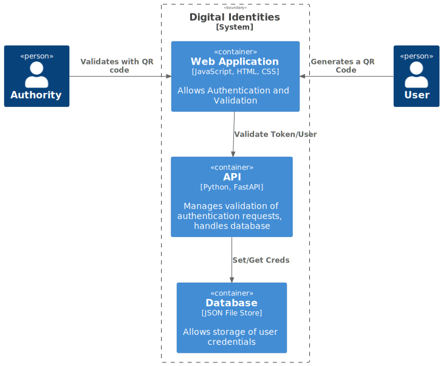

== Design

The Digital Identities system will utilize a client-server architecture.

=== Component Roles

*Server:*

A REST API that handles all requests for user login, token generation and token validation.

*Client:*

A web application that interacts with the server API. The client generates the required payloads and sends them via AJAX request.

*Database:*

Persistent data storage. The user login data is stored in the database and used for token validation.

=== Low Level Diagram

